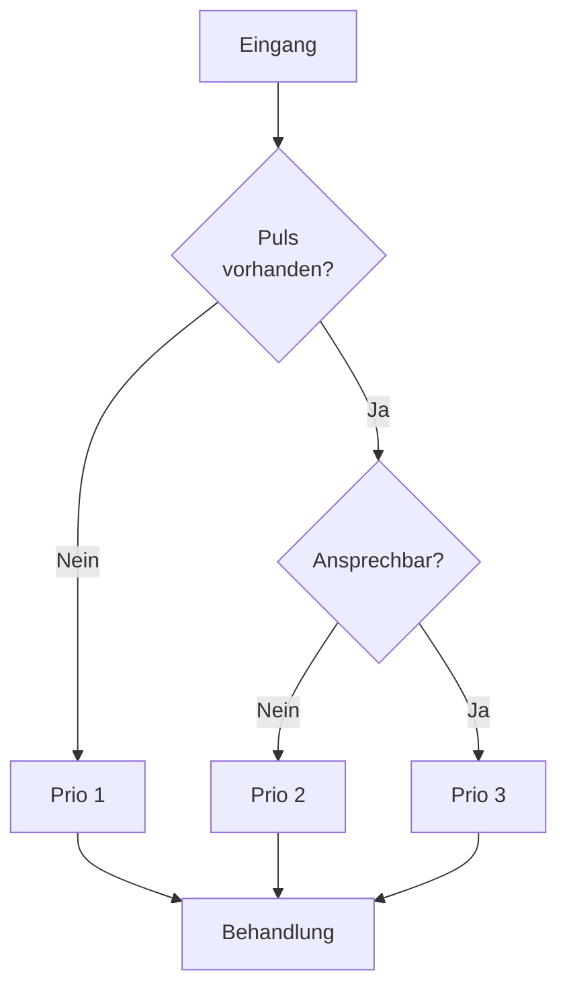
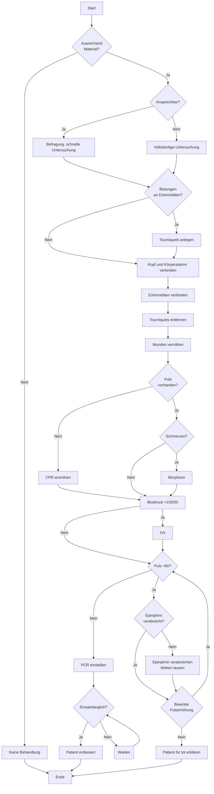

> Status: Work in Progress
{.is-info}

# ACE 3 Medical

## Allgemein

...

### Verletzungsarten

Verletzungsarten und ihre Behandlung.

|  | Schürfwunde | Avulsion | Prellung | Quetschung | Schnittwunde | Platzwunde | Ballistisches Trauma | Stichwunde |
| - | - | - | - | - | - | - | - | - |
| Verbandspäckchen | ✅ 100% | ❌ 20% | ✅ 100% | ✅ 100% | 🟠 30% |🟡 60% |❌ 20% |🟠 30% |
| Mullbinde | ✅ 100% | ✅ 100% | ✅ 100% | ✅ 100% | ❌ 20% | ❌ 20% | ✅ 100% | ❌ 20% |
| Elastische Bandage | ✅ 100% | ❌ 20% | ✅ 100% | ✅ 100% | ✅ 100% | ✅ 100% | 🟠 40% | 🟢 75% |
| QuickClot | 🟡 60% | 🟢 75% | 🟡 60%  | 🟡 60%  | 🟡 60% | 🟡 60% | 🟢 75% | 🟢 75% |
{.matable}

### Injektoren

| Injektor | Wirkung | Gefahren |
| - | - | - |
| Epinephrin | ↑ Puls (ca. 15 Schläge/min), könnte Spieler aus Bewusstlosigkeit holen | bei Herzstillstand tödlich |
| Morphin | ↓ Puls + ↓ Blutdruck + ↓ Schmerzen (ca. 55 Schläge/min) | maximal 2 Injektionen in 15 Minuten, Injektion bei niedrigem Puls/Blutdruck vermeiden |
| Atropin Bandage | ↓ Puls | - |
{.matable}

### IVs

Intravenöser Zugang. Alle IVs haben die selbe Wirkung.
IVs im Stückvolumen 250ml sind vergleichsweise sinnlos, nur 500ml oder 1l mitführen.

| IV | Blutdruck | Blutvolumen |
| - | - | - |
| Bluttransfusion | ↑ | ↑ |
| Plasmatransfusion  | ↑ | ↑ |
| Kochsalzlösung | ↑ | ↑ |
{.matable}

### Gegenstände

| Gegenstand | Wirkung | Voraussetzung | Gefahren | 
| - | - | - | - |
| Tourniquet | Stoppt Blutungen | Verursacht Schmerzen nach ca. 5 Minuten |
| Operationskit | Schließt schließt sich wiederholt öffnende Wunden | stabil | maximal 2 Injektionen in 15 Minuten, Injektion bei niedrigem Puls/Blutdruck vermeiden |
| Triagekarte | Enthält wichtige Informationen (Vor Verabreichung von Autoinjektionen unbedingt prüfen, enthält Infos über IVs, Autoinjektionen uvm) | - | - |
| Erste-Hilfe-Kasten | Vollständige Heilung + beendet Bewusstlosigkeit, stabilisiert, neutralisiert Autoinjektionen, löscht Triagekarte | stabil, in Fahrzeug / Medical Facility | - |
{.matable}

## Behandlungsablauf

**Priorisierung**

Muss mehr als ein Patient behandelt werden, sollte priorisiert werden, um einen Patienten in kritischer Lage zu erkennen und zuerst zu behandeln.

  

  

  

**Behandlung**

  
  

  

&nbsp;
